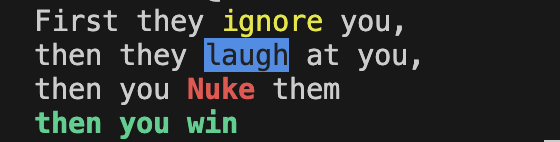

# Manging Terminal Outputs
This folder consist of output(stdout) shell script files that can be used while handling outputs.

# Colors
Use these color and font style varibales to add styles in output text. Example given in color_test.sh for both adding style and removing it for particular part. These works same as in JavaScript console log styles.



# Learnings
While importing varibale using `soucre` method using relative path causes error based on from which path the script is executed.
Example if I have used the below script in `color_test.sh`
```sh
source "color.sh"
```
the output will only be displayed when executed from
```sh
output % ./color_test.sh
```
When executed from 
```sh
shell % ./output/color_test.sh 
./output/color_test.sh: line 3: color.sh: No such file or directory
```
**So we should avoid using this** instead use
```sh
SCRIPT_DIR="$(cd "$(dirname "${BASH_SOURCE[0]}")" && pwd)"
source "$SCRIPT_DIR/color.sh"
```
This `SCRIPT_DIR` always point towards the **directory** where the script is executed.
* What this actually do is get directory name from input `$0 or BASH_SOURCE` and change its directroy to it
* now execute `pwd` to get absolute (or a relative path from the root) so the `source` can find right directory

